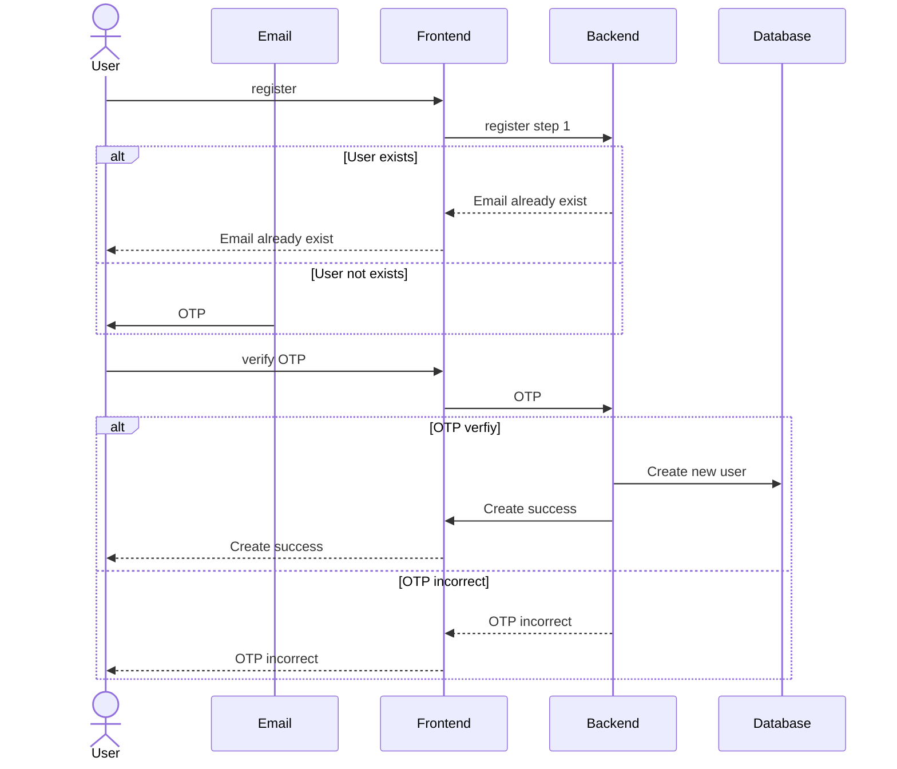
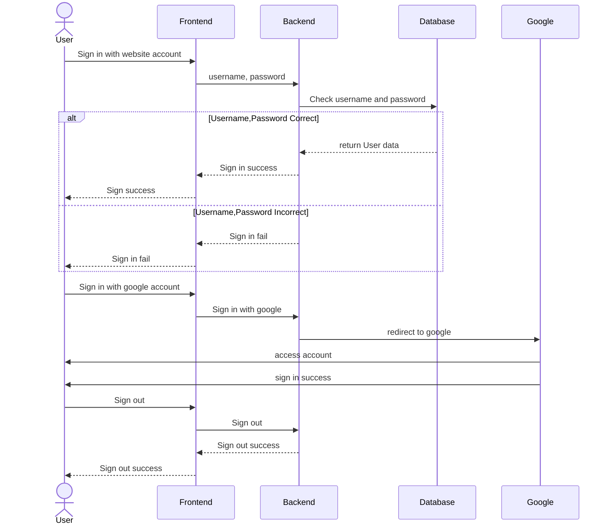
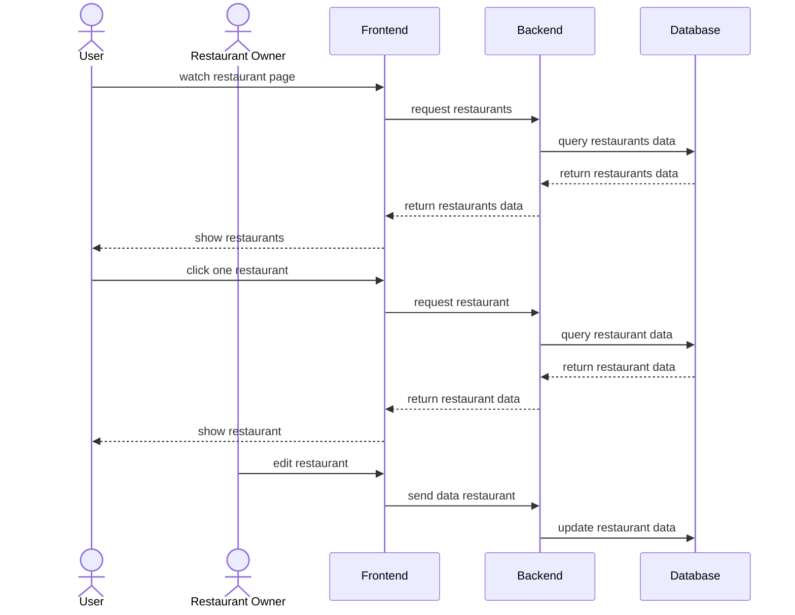
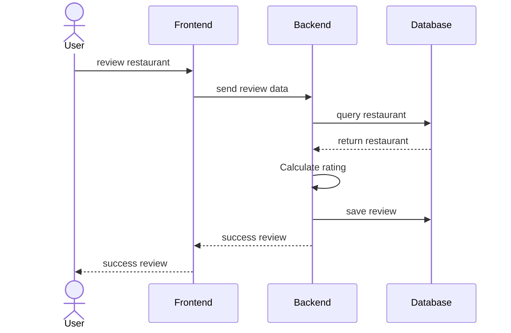

# TasteTrail 🍽️

## Restaurant Review Platform around KMITL PCC

A modern full-stack web application for discovering, reviewing, and managing restaurants in the KMITL PCC area. Built with cutting-edge technologies to provide an exceptional user experience.

## 🏗️ Project Structure

- **frontend/** – Next.js 15 with App Router, React 19, TypeScript, Tailwind CSS v4
- **backend/** – Express.js TypeScript API with Prisma ORM
- **n8n/** – Workflow automation and integrations
- **docker-compose.yml** – Multi-service container orchestration

## ✨ Features

### 🎯 Core Features

- **Restaurant Discovery** – Browse and search restaurants with advanced filtering
- **Review System** – Rate and review restaurants with detailed feedback
- **User Authentication** – Secure login/register with OTP verification and Google OAuth
- **Restaurant Management** – Owners can create and manage their restaurant listings
- **Interactive Maps** – Location-based restaurant discovery with Leaflet integration
- **Real-time Features** – Live updates and notifications

### 🛠️ Technical Features

- **Modern Frontend** – Next.js 15 with App Router, React 19, TypeScript
- **Responsive Design** – Mobile-first approach with Tailwind CSS v4
- **Component Library** – shadcn/ui + Radix UI for accessible components
- **State Management** – Zustand for global state, React Query for server state
- **Form Handling** – React Hook Form with Zod validation
- **Database** – PostgreSQL with Prisma ORM
- **Caching** – Redis for session management and performance
- **File Storage** – Cloudinary for image uploads and management
- **Email Service** – Nodemailer for OTP and notifications
- **Security** – CSRF protection, rate limiting, and secure authentication
- **AI Integration** – Ollama for AI-powered recommendations
- **Workflow Automation** – n8n for business process automation

## 🚀 Getting Started

### Quick Start with Docker

1. **Clone the repository**

   ```sh
   git clone <repository-url>
   cd tastetrail
   ```

2. **Set up environment variables**

   ```sh
   cp .env.example .env
   # Edit .env with your configuration
   ```

3. **Start all services**

   ```sh
   docker-compose up -d --build
   ```

4. **Access the application**
   - Frontend: http://localhost:3000
   - Backend API: http://localhost:3001
   - n8n Workflows: http://localhost:5678
   - Ollama AI: http://localhost:11434

### Prerequisites

- **Node.js** (v18+ for backend, v20+ for frontend recommended)
- **Docker & Docker Compose** (recommended)
- **PostgreSQL** (if running without Docker)
- **Redis** (if running without Docker)

### Manual Installation (Development)

If you prefer to run services individually:

1. **Install backend dependencies**

   ```sh
   cd backend
   npm install
   ```

2. **Install frontend dependencies**

   ```sh
   cd frontend
   npm install
   ```

3. **Set up the database**
   ```sh
   cd backend
   npx prisma migrate dev
   npm run seed
   ```

### Development

#### Backend Development

```sh
cd backend
npm run dev
```

#### Frontend Development

```sh
cd frontend
npm run dev
```

#### Available Scripts

**Backend:**

- `npm run dev` - Start development server with hot reload
- `npm run build` - Build for production
- `npm run start` - Start production server
- `npm run seed` - Seed database with sample data
- `npm run lint` - Run ESLint

**Frontend:**

- `npm run dev` - Start development server with Turbopack
- `npm run build` - Build for production
- `npm run start` - Start production server
- `npm run lint` - Run ESLint

## 🏗️ Building for Production

### Backend

```sh
cd backend
npm run build
npm run start
```

### Frontend

```sh
cd frontend
npm run build
npm run start
```

## 🐳 Docker Services

The application includes several Docker services:

### Core Services

- **Backend** - Express.js API server
- **Frontend** - Next.js application (currently commented out in docker-compose)
- **Database** - PostgreSQL 16.3 with persistent storage
- **Redis** - Session storage and caching
- **n8n** - Workflow automation platform
- **Ollama** - AI model server for recommendations

### AI Model Setup

```sh
# Pull the AI model for recommendations
docker exec ollama ollama pull llama3.2
```

### Environment Variables

Key environment variables needed:

```env
# Database
DATABASE_URL=postgres://admin:12345@db:5432/review_restaurant?schema=public

# Redis
REDIS_URL=redis://redis:6379

# Email (for OTP)
EMAIL_USER=your-email@gmail.com
EMAIL_PASS=your-app-password

# Google OAuth
GOOGLE_CLIENT_ID=your-google-client-id
GOOGLE_CLIENT_SECRET=your-google-client-secret

# Cloudinary (for image uploads)
CLOUDINARY_CLOUD_NAME=your-cloud-name
CLOUDINARY_API_KEY=your-api-key
CLOUDINARY_API_SECRET=your-api-secret

# Session
SESSION_SECRET=your-secret-key
```

## Sequence Diagram

### Authentication

#### Sign Up



#### Sign In, Sign Out



### Restaurant



### Review



## 📚 API Documentation

### Authentication Endpoints

- `POST /auth/register/send-otp` - Send OTP for registration
- `POST /auth/register/verify` - Verify OTP and create user
- `POST /auth/login` - Login with credentials
- `GET /auth/logout` - Logout user
- `POST /auth/forgotPass` - Request password reset
- `GET /auth/google` - Google OAuth login
- `GET /auth/me` - Get current user info

### Restaurant Endpoints

- `GET /restaurant/get` - Get all restaurants
- `GET /restaurant/get/:id` - Get restaurant by ID
- `GET /restaurant/popular` - Get popular restaurants
- `POST /account/openRestaurant` - Create new restaurant

### Account Endpoints

- `PUT /account/updateProfile` - Update user profile
- `POST /account/openRestaurant` - Open new restaurant

## 🛠️ Tech Stack

### Frontend

- **Framework**: Next.js 15 with App Router
- **Language**: TypeScript
- **Styling**: Tailwind CSS v4
- **UI Components**: shadcn/ui + Radix UI
- **State Management**: Zustand
- **Forms**: React Hook Form + Zod
- **Maps**: Leaflet + React Leaflet
- **Icons**: Lucide React

### Backend

- **Runtime**: Node.js with Express.js
- **Language**: TypeScript
- **Database**: PostgreSQL with Prisma ORM
- **Authentication**: Passport.js (Local + Google OAuth)
- **Session**: Redis with express-session
- **File Upload**: Multer + Cloudinary
- **Email**: Nodemailer
- **Security**: Helmet, CORS, CSRF protection

### DevOps & Tools

- **Containerization**: Docker & Docker Compose
- **Database**: PostgreSQL 16.3
- **Caching**: Redis 7.0
- **AI**: Ollama with Llama 3.2
- **Automation**: n8n workflows
- **Version Control**: Git

## 🤝 Contributing

1. Fork the repository
2. Create a feature branch (`git checkout -b feature/amazing-feature`)
3. Commit your changes (`git commit -m 'Add amazing feature'`)
4. Push to the branch (`git push origin feature/amazing-feature`)
5. Open a Pull Request

## 📄 License

This project is licensed under the MIT License - see the [LICENSE](LICENSE) file for details.

---

Built with ❤️ using Next.js, Express, and modern web technologies
